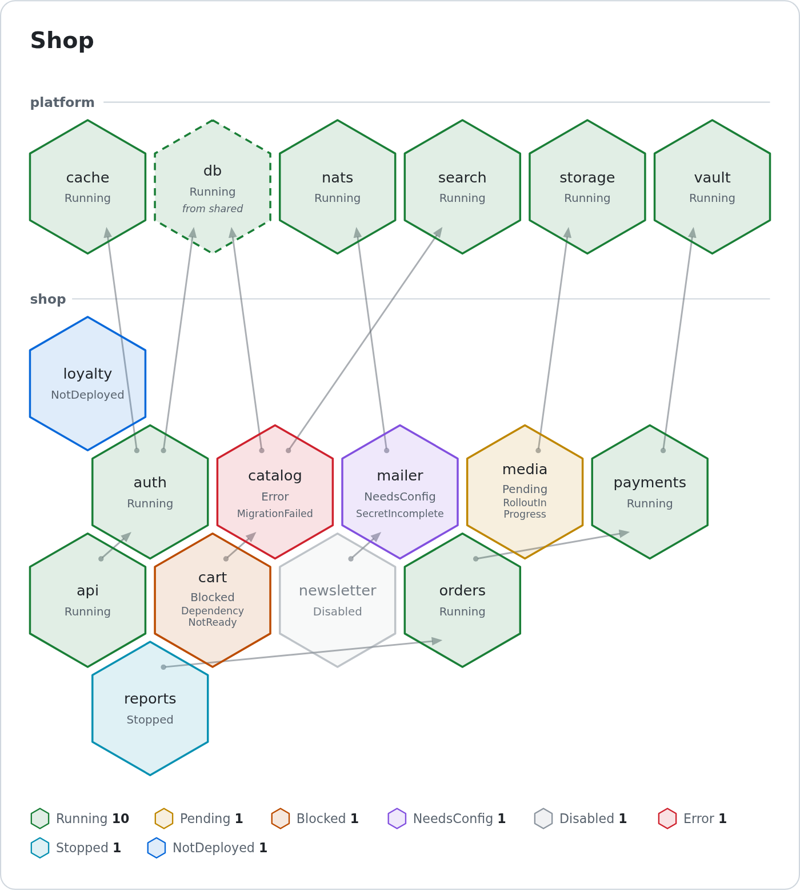
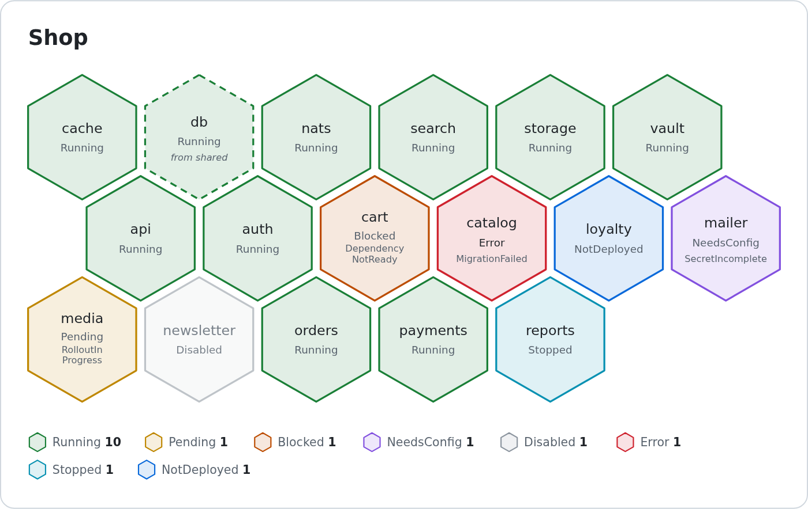

# Kubernetes::Comb::SVG

Render [Kubernetes::Comb](https://metacpan.org/pod/Kubernetes::Comb) custom
resources as an SVG honeycomb.

[](examples/demo.svg)

The same Combs with `layout => 'packed'`, the status monitor for a wall screen:

[](examples/monitor.svg)

Both pictures are rendered from `examples/demo.json` by `examples/demo.pl`;
click one for the SVG itself, which follows light and dark mode and, in the
monitor, pulses the Comb in `Error`.

## Synopsis

```perl
use Kubernetes::Comb::SVG;

my $svg = Kubernetes::Comb::SVG->new(
  combs       => \@combs,              # Comb CRs: hashes or IO::K8s objects
  title       => 'Lab',
  group_label => 'app.kubernetes.io/part-of',
)->render;
```

```bash
kubectl get combs -A -o json | comb-svg > combs.svg
```

## Description

One hexagon per Comb, coloured by its phase, with the name, the phase and,
when the Comb is not Running, the reason written into it. The result is one
self-contained SVG document — no script, no external font or stylesheet — that
follows the viewer's light or dark mode and can be embedded in any page.

The dist does not talk to a cluster and ships no server: it turns the CRs you
hand it into a picture. The design is in [SPEC.md](SPEC.md); every option is
documented in the POD of `Kubernetes::Comb::SVG` and of `comb-svg`.

## Dependencies: `layout => 'depth'`

The default. Combs are grouped by a label of your choice and sit one row below
what they depend on; `spec.dependsOn` is drawn as arrows.

```perl
Kubernetes::Comb::SVG->new(
  combs       => \@combs,
  group_label => 'app.kubernetes.io/part-of',
  columns     => 6,
  link        => sub { '/combs/'.$_[0]->name },   # cells become links
)->render;
```

## Status monitor: `layout => 'packed'`

All Combs sorted by name in one compact honeycomb that fits a screen, so a
glance shows what is not green. The grid comes from `columns`, else `rows`,
else `aspect`.

```perl
Kubernetes::Comb::SVG->new(
  combs  => \@combs,
  layout => 'packed',
  aspect => 16 / 9,                    # or rows => 3, or columns => 8
  blink  => [ 'Error', 'Blocked' ],    # these phases pulse
)->render;
```

```bash
comb-svg combs.json --layout packed --aspect 16:9 --blink Error,Blocked > monitor.svg
```

## Colours

`theme` sets the colour of a phase or of a surface (`bg`, `fg`, `muted`,
`border`, `edge`), for both modes or one each:

```perl
theme => {
  Running => '#2da44e',
  Error   => { light => 'crimson', dark => '#ff6b6b' },
}
```

```bash
comb-svg combs.json --color Error=#ff0033 --color 'bg=#ffffff,#000000' > combs.svg
```

A page that inlines the SVG can restyle it with CSS instead: the colours are
custom properties (`--comb-error`, `--comb-bg`, …) and the cells carry classes
(`.comb.phase-Error`).

## License

This is free software; you can redistribute it and/or modify it under the same
terms as the Perl 5 programming language system itself.
